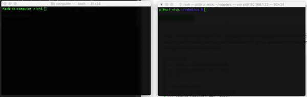

# Raspberry Pi <-> Computer connection

Set up a connection between your RaspberryPi (server) and computer (client)

Steps to setup:
* copy `server.py` from `raspberryPi` directory to your pi.
* start your server: run `python3 server.py` on your Raspberry Pi
* start your client: run `python3 client.py` on your computer
* start sending messages!

